This is just a recreation of the presentation by **Alison Presmanes Hill**.
You can follow her on twitter at https://twitter.com/apreshill

My main objective is to reproduce the content from her [presentation](https://alison.netlify.com/uo-tidy-bakeoff) as the visualization is awesome.


```r
suppressWarnings(library(tidyverse)) 
```

```
## -- Attaching packages ------------------------------------------------------------------------------- tidyverse 1.2.1 --
```

```
## v ggplot2 3.0.0     v purrr   0.2.5
## v tibble  1.4.2     v dplyr   0.7.6
## v tidyr   0.8.1     v stringr 1.3.1
## v readr   1.1.1     v forcats 0.3.0
```

```
## -- Conflicts ---------------------------------------------------------------------------------- tidyverse_conflicts() --
## x dplyr::filter() masks stats::filter()
## x dplyr::lag()    masks stats::lag()
```

```r
#library(backoff) #I am not using this
```


```r
data_url = "https://raw.githubusercontent.com/apreshill/bakeoff/master/data-raw/ratings_seasons.csv"
ratings_seasons = read.csv(data_url, stringsAsFactors = FALSE)
# write.csv(ratings_seasons,"ratings_seasons.csv", row.names = FALSE)
head(ratings_seasons)
```

```
##   series episode uk_airdate viewers_7day viewers_28day network_rank
## 1      1       1 2010-08-17         2.24             7           NA
## 2      1       2 2010-08-24         3.00             3           NA
## 3      1       3 2010-08-31         3.00             2           NA
## 4      1       4 2010-09-07         2.60             4           NA
## 5      1       5 2010-09-14         3.03             1           NA
## 6      1       6 2010-09-21         2.75             1           NA
##   channels_rank bbc_iplayer_requests us_season us_airdate
## 1            NA                   NA        NA       <NA>
## 2            NA                   NA        NA       <NA>
## 3            NA                   NA        NA       <NA>
## 4            NA                   NA        NA       <NA>
## 5            NA                   NA        NA       <NA>
## 6            NA                   NA        NA       <NA>
```


```r
ratings <- ratings_seasons %>% 
  mutate(series = as.factor(series))
```

```
## Warning: package 'bindrcpp' was built under R version 3.4.4
```

```r
glimpse(ratings)
```

```
## Observations: 74
## Variables: 10
## $ series               <fct> 1, 1, 1, 1, 1, 1, 2, 2, 2, 2, 2, 2, 2, 2,...
## $ episode              <int> 1, 2, 3, 4, 5, 6, 1, 2, 3, 4, 5, 6, 7, 8,...
## $ uk_airdate           <chr> "2010-08-17", "2010-08-24", "2010-08-31",...
## $ viewers_7day         <dbl> 2.24, 3.00, 3.00, 2.60, 3.03, 2.75, 3.10,...
## $ viewers_28day        <dbl> 7, 3, 2, 4, 1, 1, 2, 2, 1, 1, 1, 1, 1, 1,...
## $ network_rank         <int> NA, NA, NA, NA, NA, NA, NA, NA, NA, NA, N...
## $ channels_rank        <int> NA, NA, NA, NA, NA, NA, NA, NA, NA, NA, N...
## $ bbc_iplayer_requests <dbl> NA, NA, NA, NA, NA, NA, NA, NA, NA, NA, N...
## $ us_season            <int> NA, NA, NA, NA, NA, NA, NA, NA, NA, NA, N...
## $ us_airdate           <chr> NA, NA, NA, NA, NA, NA, NA, NA, NA, NA, N...
```

### Recipe 1: Continuous Bar Chart

```r
# create continuous episode count
plot_off1 <- ratings %>% 
  mutate(ep_id = row_number()) %>%
  select(ep_id, viewers_7day, series, episode)

# create coordinates for labels
series_labels <- plot_off1 %>% 
  group_by(series) %>% 
  summarize(y_position = median(viewers_7day) + 1,
            x_position = mean(ep_id))

# make the plot
ggplot(plot_off1, aes(x = ep_id, y = viewers_7day, fill = series)) +
  geom_col(alpha = .9) +
  ggtitle("Series 8 was a Big Setback in Viewers",
          subtitle= "7-Day Viewers across All Series/Episodes") +
  geom_text(data = series_labels, aes(label = series,
                                      x = x_position, 
                                      y = y_position)) +
  theme(axis.text.x = element_blank(),
        axis.ticks.x = element_blank(),
        axis.title.x = element_blank(),
        panel.grid.major.x = element_blank(),
        panel.grid.minor.x = element_blank()) + 
  # scale_fill_bakeoff(guide = FALSE) + #this theme comes with "backoff" package so using theme_minimal
  theme_minimal()+ #can also use theme_bw()
  scale_x_continuous(expand = c(0, 0))
```

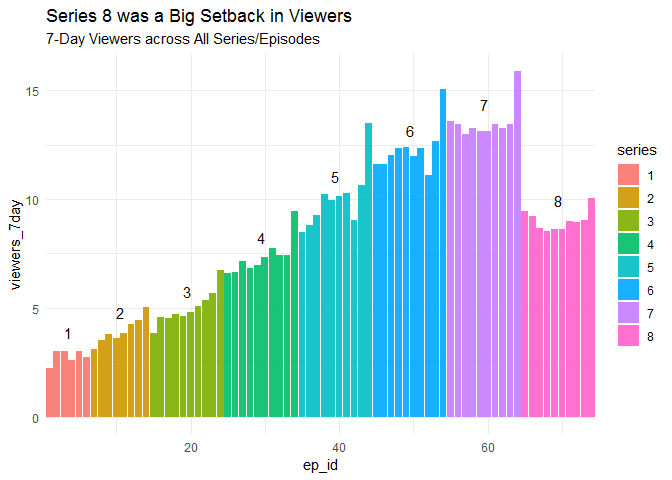<!-- -->


### Recipe 2: Code for Lollipop Plot


```r
plot_off2 <- ratings %>% 
  group_by(series) %>%
  mutate(series_avg = mean(viewers_7day, na.rm = TRUE),
         diff_avg = viewers_7day - series_avg) %>%
  filter(max(episode) == 10) %>% 
  mutate(episode = as.factor(episode)) %>% 
  select(episode, viewers_7day, series, diff_avg, series_avg)

ggplot(plot_off2, aes(x = episode, y = viewers_7day, color = diff_avg)) +
  geom_hline(aes(yintercept = series_avg), alpha = .5) +
  geom_point() +
  geom_segment(aes(xend = episode, yend = series_avg)) +
  facet_wrap(~series) +
  scale_color_viridis_c(option="plasma", begin = 0,
                      end = .8, guide = FALSE) +
  theme_minimal() + 
  ggtitle("Great British Bake Off Finales Get the Most Viewers",
          subtitle = "Way Higher than Series Average (for Series with 10 episodes)")
```

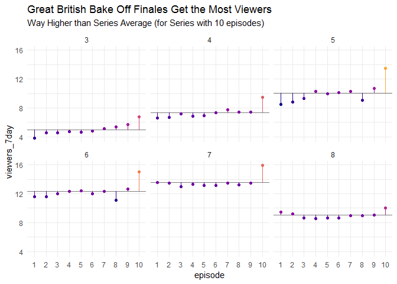<!-- -->

Try commenting `scale_color_viridis_c` and running the code to see the difference in colours

### Recipe 3: Series Line Plot


```r
line_labels <- ratings %>% 
  group_by(series) %>% 
  filter(episode == max(episode)) %>% 
  select(series, x_position = episode, y_position = viewers_7day)

ggplot(ratings, aes(x = as.factor(episode),
                    y = viewers_7day,
                    color = as.factor(series),
                    group = series)) +
  geom_line() +
  # scale_color_bakeoff(guide = FALSE) +
  theme_minimal() + 
  labs(color = "Series", x = "Episode") +
  geom_text(data = line_labels, aes(label = series,
                                      x = x_position + .25, 
                                      y = y_position))
```

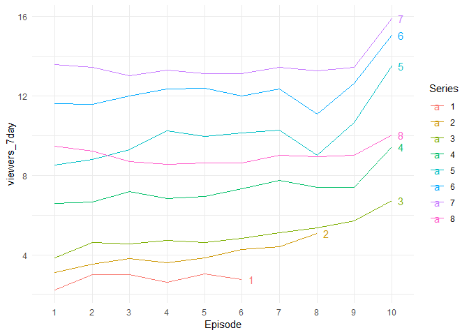<!-- -->

### Recipe 4: Facetted Line Plot


```r
ggplot(ratings, aes(x = as.factor(episode),
                    y = viewers_7day,
                    color = fct_reorder2(series, episode, viewers_7day),
                    group = series)) +
  facet_wrap(~series) +
  geom_line(lwd = 2) +
  # scale_color_bakeoff(guide = FALSE) +
  theme_minimal() + 
  labs(color = "Series", x = "Episode")
```

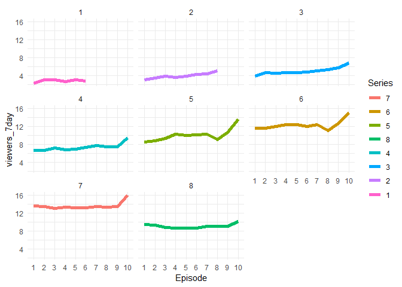<!-- -->

### Recipe 5: First vs. Last


```r
# some wrangling here
plot_off5 <- ratings %>% 
  select(series, episode, viewers_7day) %>% 
  group_by(series) %>%
  filter(episode == 1 | episode == max(episode)) %>%
  mutate(episode = recode(episode, `1` = "first", .default = "last")) %>%
  ungroup()
# code for plot
ggplot(plot_off5, aes(x = series,
                      y = viewers_7day,
                      color = fct_reorder2(episode, series, viewers_7day),
                      group = episode)) +
  geom_point() +
  geom_line() +
  # scale_color_bakeoff() +
  theme_minimal() +
  ggtitle("Great British Bake Off Finales Get More Viewers than Premieres") +
  labs(color = "Episode")
```

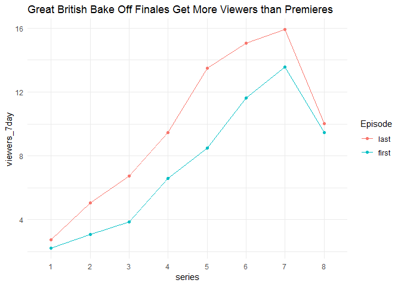<!-- -->

### Recipe 6: Dumbbell Plot


```r
ggplot(plot_off5, aes(x = viewers_7day,
                      y = fct_rev(series),
                      color = episode,
                      group = series)) +
  geom_line(size = .75) +
  geom_point(size = 2.5) +
  # scale_color_bakeoff() +
  theme_minimal() +
  labs(y = "Series", x = "Viewers (millions)", color = "Episode") +
  ggtitle("Great British Bake Off Finales Get More Viewers than Premieres")
```

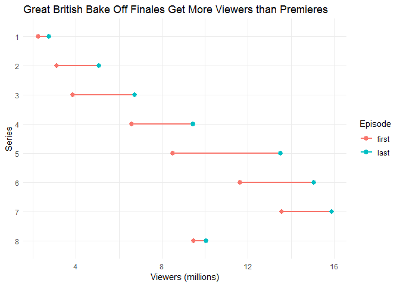<!-- -->

### Recipe 7: Slope Graph


```r
slope_labels <- plot_off5 %>% 
  filter(episode == "last") %>% 
  select(series, x_position = episode, y_position = viewers_7day)

ggplot(plot_off5, aes(x = episode,
                      y = viewers_7day,
                      color = series,
                      group = series)) +
  geom_point() +
  geom_line() +
  # scale_color_bakeoff(guide = FALSE) +
  theme_minimal() +
  geom_text(data = slope_labels, aes(label = series,
                                    x = x_position,
                                    y = y_position),
            nudge_x = .1) +
  theme(panel.grid = element_blank(),
        axis.line = element_line(color = "gray"))
```

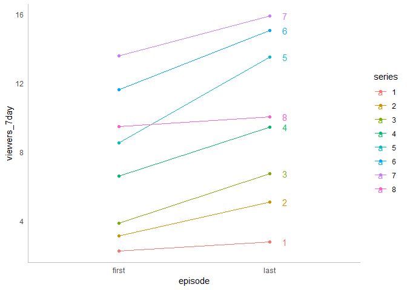<!-- -->
### Recipe 8: Finale "Bumps"


```r
# some more serious wrangling here
plot_off8 <- ratings %>% 
  select(series, episode, viewers_7day) %>% 
  group_by(series) %>% 
  filter(episode == 1 | episode == max(episode)) %>% 
  mutate(episode = recode(episode, `1` = "first", .default = "last")) %>%
  spread(episode, viewers_7day) %>%
  mutate(finale_bump = last - first)

# plot
ggplot(plot_off8, aes(x = fct_rev(series),
                      y = finale_bump)) +
  geom_col(fill="blue",alpha = .7) +
  # geom_col(fill = bakeoff_cols("baltic"), alpha = .7) +
  coord_flip() +
  labs(x = "Series", y = "Difference in Viewers for Finale from Premiere (millions)") +
  ggtitle("Finale 'Bumps' were Smallest for Series 1 and 8",
          subtitle = "Finale 7-day Viewers Relative to Premiere")+
  theme_minimal()
```

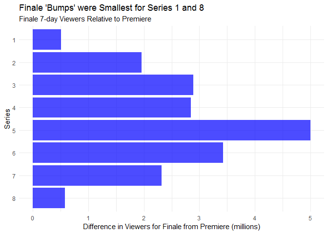<!-- -->

### Recipe 9: Code for % Bar


```r
# wrangling to calculate percent change
plot_off9 <- ratings %>% 
  select(series, episode, viewers_7day) %>% 
  group_by(series) %>% 
  filter(episode == 1 | episode == max(episode)) %>% 
  ungroup() %>% 
  mutate(episode = recode(episode, `1` = "first", .default = "last")) %>% 
  spread(episode, viewers_7day) %>%
  mutate(pct_change = (last - first) / first)

# plot
ggplot(plot_off9, aes(x = fct_rev(series),
                      y = pct_change)) +
  geom_col(fill = "magenta", alpha = .5) + #bakeoff_cols("baltic")
  geom_hline(aes(yintercept = median(pct_change, na.rm = TRUE)), 
             color = "blue", #bakeoff_cols("berry")
             lwd = 2) +
  labs(x = "Series", y = "% Increase in Viewers, First to Last Episode") +
  ggtitle("Series 8 had a 6% Increase in Viewers from Premiere to Finale",
          subtitle= "The Lowest Across All Series (Line is the Median)") + 
  scale_y_continuous(labels = scales::percent) +
  coord_flip()
```

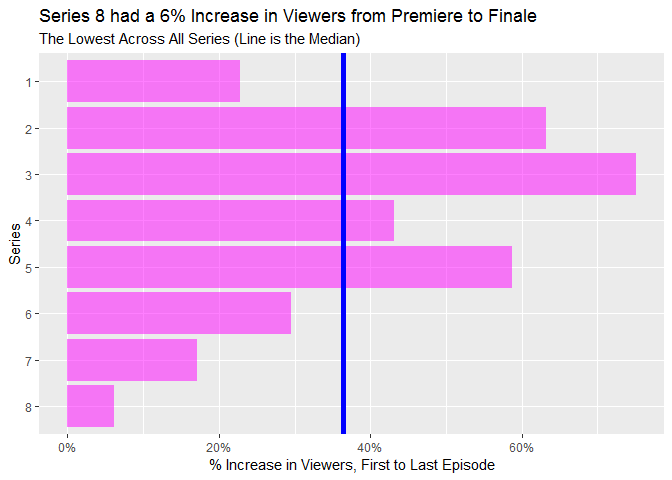<!-- -->


### Recipe 10: Lollipop Plot, % Change


```r
# plot
ggplot(plot_off9, aes(x = fct_rev(series),
                      y = pct_change)) +
  geom_point(color = "blue", size = 2) + #bakeoff_cols("bluesapphire")
  geom_segment(aes(xend = fct_rev(series), yend = 0), color = "blue") + #bakeoff_cols("bluesapphire")
  geom_text(aes(label = scales::percent(pct_change)), hjust = -.25) +
  labs(x = "Series", y = "% Change in Viewers from First to Last Episode") +
  ggtitle("Percent Increase in Viewers was the Smallest for Series 8",
          subtitle= "Finale 7-day Viewers Relative to Premiere") +
  scale_y_continuous(labels = scales::percent, limits = c(0, .85)) +
  coord_flip()
```

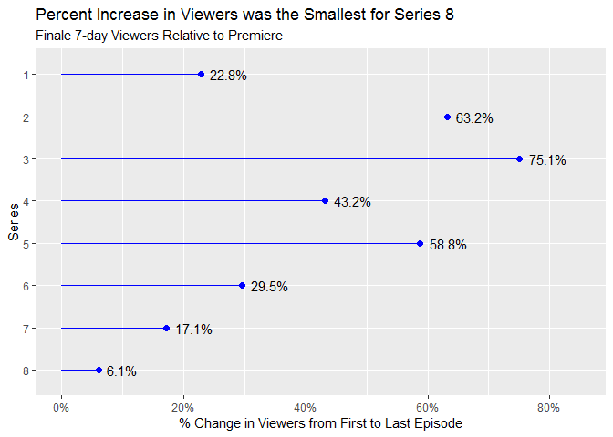<!-- -->

### Recipe 11: Scatterplot


```r
ggplot(plot_off8, aes(x = first, y = last)) +
  geom_point() +
  geom_smooth(se = FALSE, color = '#EBBFDD') +
  geom_abline(slope = 1, intercept = 0, color = "gray", alpha = .5) +
  geom_text(aes(label = series), hjust = -1) +
  labs(x = "Premiere Episode 7-day Viewers (millions)",
       y = "Finale Episode 7-day Viewers (millions)") +
  coord_equal(ratio=1) +
  theme_minimal()
```

```
## `geom_smooth()` using method = 'loess' and formula 'y ~ x'
```

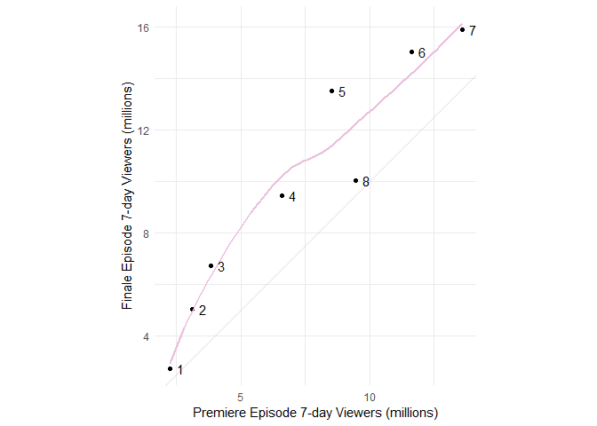<!-- -->

#### Recipe 11.1: Pop-Out Scatterplot


```r
ggplot(plot_off8, aes(x = first, y = last)) +
  geom_abline(slope = 1, intercept = 0, color = "gray", alpha = .5) +
  geom_smooth(se = FALSE, color = "#11B2E8") +
  geom_point(data = filter(plot_off8, series %in% c(1:7))) +
  geom_point(data = filter(plot_off8, series == 8), colour = "#CF2154") +
  geom_text(data = filter(plot_off8, series %in% c(1:7)),
            aes(label = series), hjust = -1) +
  geom_text(data = filter(plot_off8, series == 8),
            aes(label = series), hjust = -1, colour = "#CF2154") +
  labs(x = "Premiere Episode 7-day Viewers (millions)",
       y = "Finale Episode 7-day Viewers (millions)") +
  theme_minimal()
```

```
## `geom_smooth()` using method = 'loess' and formula 'y ~ x'
```

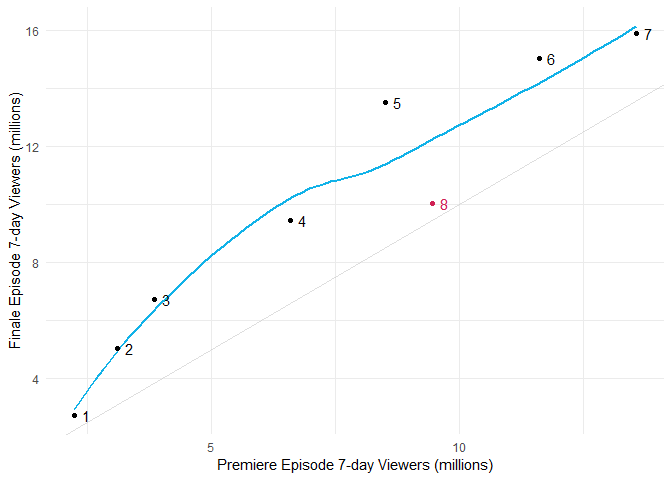<!-- -->

